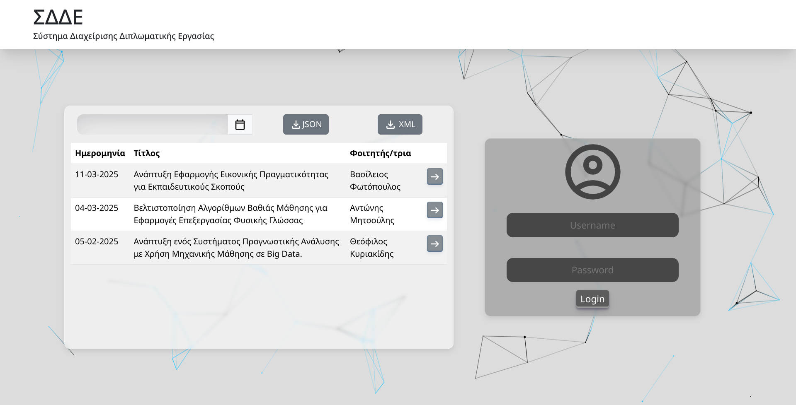
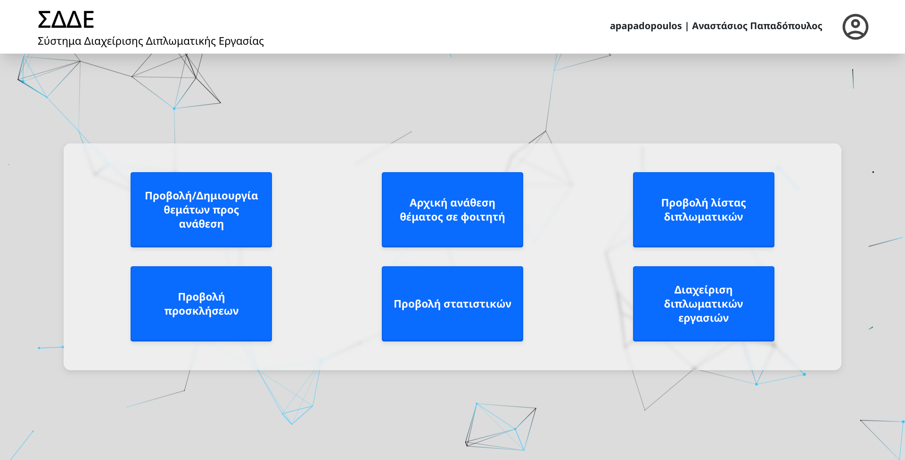
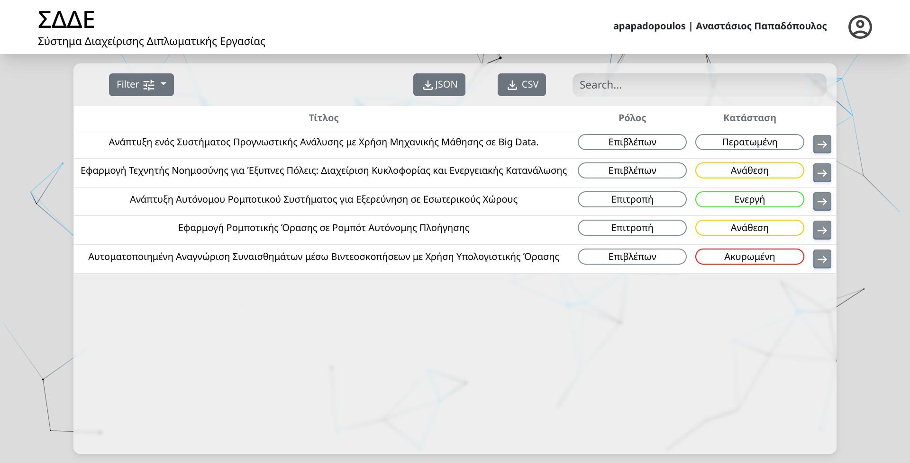
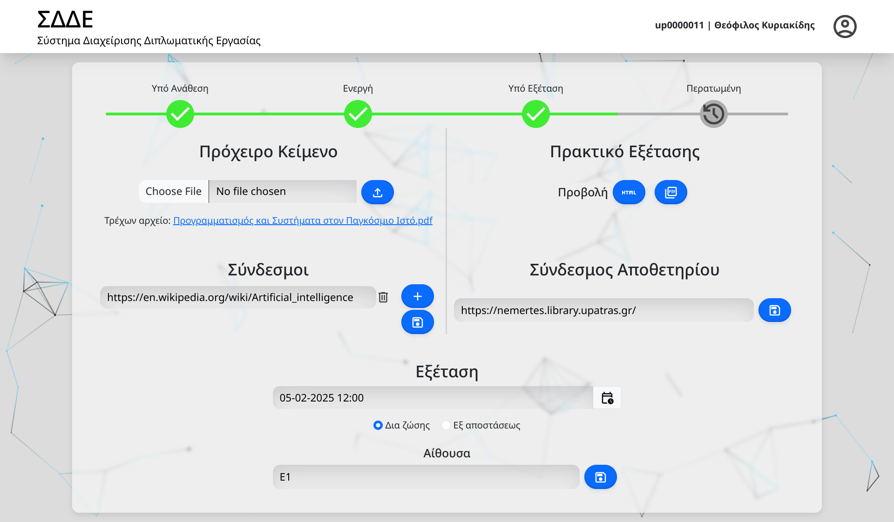
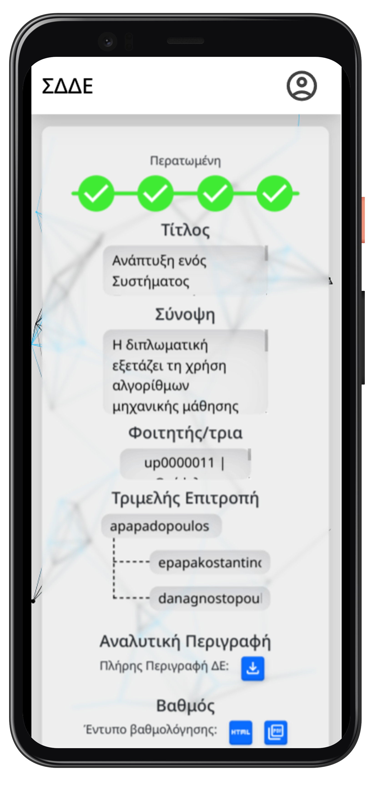

Thesis management website for students and university personnel, created for the course "Programming & Systems in the World Wide Web" - 7th Semester CEID 

<em>if the thesis-description-file is not saved do:  chmod 0777 Data/ThesisDescriptions</em>

